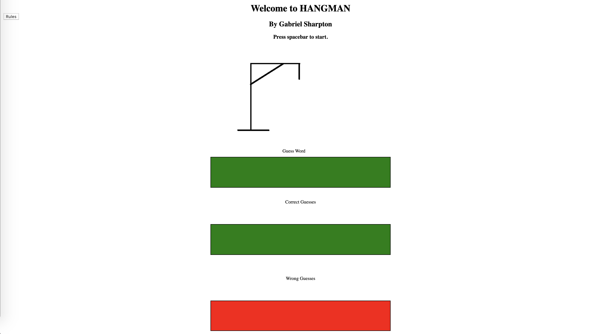

# Hangman-Javascript-Game

-------------------------
I made a hangman game using HTML, CSS, and Javascript.
The user has a random word selected from an array of words I created.
All you have to do to start is selected a button on your keyboard to start.

>Each key press counts as a guess. If the key you selected is in the chosen word, it replaces an underscore with that letter and adds it into the correct guess array.

>If the key you selected is wrong (or not a letter) you lose one of your guess amounts and it is displayed in the incorrect guess box.

>For testing purposes I have the random word logged in the console.

>With each guess amount you have left there is a new picture that will appear.

>It is still a very basic version of what I would like for it to be but it works and was built from scratch.

**To see my game vist this website**

(https://gabesharpton.github.io/Hangman-Javascript-Game/#)

**This is my first project, hope you enjoy!**
